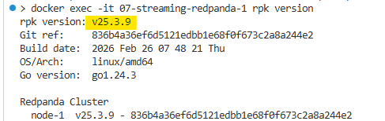
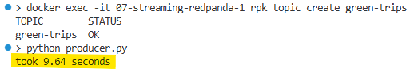
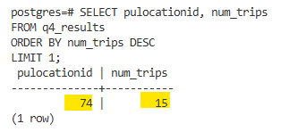

# Module 7 Homework – 07-streaming
In this homework, we'll practice streaming with Kafka (Redpanda) and PyFlink.

We use Redpanda, a drop-in replacement for Kafka. It implements the same protocol, so any Kafka client library works with it unchanged.

For this homework we will be using Green Taxi Trip data from October 2025

Setup:
```
cd 07-streaming/
docker compose build
docker compose up -d
```
---

## Question 1: Redpanda version
Run `rpk version` inside the Redpanda container:
```
docker exec -it workshop-redpanda-1 rpk version
```

What version of Redpanda are you running?

#### Pic : 


#### Ans : 
Redpanda version = v25.3.9 ✅


## Question 2: Sending data to Redpanda
Create a topic called `green-trips`:
```
docker exec -it workshop-redpanda-1 rpk topic create green-trips
```
Now write a producer to send the green taxi data to this topic.

Read the parquet file and keep only these columns:

- lpep_pickup_datetime
- lpep_dropoff_datetime
- PULocationID
- DOLocationID
- passenger_count
- trip_distance
- tip_amount
- total_amount

Convert each row to a dictionary and send it to the `green-trips` topic. You'll need to handle the datetime columns - convert them to strings before serializing to JSON.

Measure the time it takes to send the entire dataset and flush:
```
from time import time

t0 = time()

# send all rows ...

producer.flush()

t1 = time()
print(f'took {(t1 - t0):.2f} seconds')
```

How long did it take to send the data?

#### Pic : 

#### Ans : 
10 seconds ✅


## Question 3: Consumer - trip distance
Write a Kafka consumer that reads all messages from the `green-trips` topic (set `auto_offset_reset='earliest'`).

Count how many trips have a `trip_distance` greater than 5.0 kilometers.

How many trips have `trip_distance` > 5?

#### Pic : 

#### Ans : 
8506 ✅

# Part 2: PyFlink (Questions 4-6)

For the PyFlink questions, you'll adapt the workshop code to work with the green taxi data. The key differences from the workshop:

- Topic name: `green-trips` (instead of `rides`)
- Datetime columns use `lpep_` prefix (instead of `tpep_`)
- You'll need to handle timestamps as strings (not epoch milliseconds)

You can convert string timestamps to Flink timestamps in your source DDL:
```
lpep_pickup_datetime VARCHAR,
event_timestamp AS TO_TIMESTAMP(lpep_pickup_datetime, 'yyyy-MM-dd HH:mm:ss'),
WATERMARK FOR event_timestamp AS event_timestamp - INTERVAL '5' SECOND
```
Before running the Flink jobs, create the necessary PostgreSQL tables for your results.

Important notes for the Flink jobs:

- Place your job files in `workshop/src/job/` - this directory is mounted into the Flink containers at `/opt/src/job/`
- Submit jobs with: `docker exec -it workshop-jobmanager-1 flink run -py /opt/src/job/your_job.py`
- The `green-trips` topic has 1 partition, so set parallelism to 1 in your - Flink jobs (`env.set_parallelism(1)`). With higher parallelism, idle consumer subtasks prevent the watermark from advancing.
- Flink streaming jobs run continuously. Let the job run for a minute or two until results appear in PostgreSQL, then query the results. You can cancel the job from the Flink UI at http://localhost:8081
- If you sent data to the topic multiple times, delete and recreate the topic to avoid duplicates: `docker exec -it workshop-redpanda-1 rpk topic delete green-trips`

## Question 4: Tumbling window - pickup location
Create a Flink job that reads from `green-trips` and uses a 5-minute tumbling window to count trips per `PULocationID`.

Write the results to a PostgreSQL table with columns: `window_start`, `PULocationID`, `num_trips`.

After the job processes all data, query the results:
```
SELECT PULocationID, num_trips
FROM <your_table>
ORDER BY num_trips DESC
LIMIT 3;
```
Which PULocationID had the most trips in a single 5-minute window?
#### Solution : 
```
SELECT pulocationid, num_trips
FROM q4_results
ORDER BY num_trips DESC
LIMIT 1;
```
#### Pic : 

#### Ans : 
74 ✅


## Question 5: Tumbling window - pickup location
Create another Flink job that uses a session window with a 5-minute gap on `PULocationID`, using `lpep_pickup_datetime` as the event time with a 5-second watermark tolerance.

A session window groups events that arrive within 5 minutes of each other. When there's a gap of more than 5 minutes, the window closes.

Write the results to a PostgreSQL table and find the `PULocationID` with the longest session (most trips in a single session).

How many trips were in the longest session?

#### Solution : 
```
SELECT window_start, window_end, PULocationID, num_trips
FROM q5_results
ORDER BY num_trips DESC
LIMIT 3;
```

#### Ans : 
81 ✅
